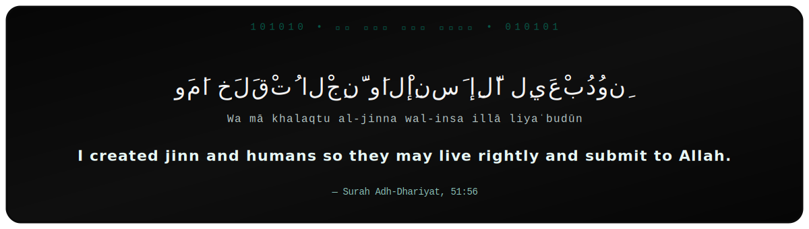
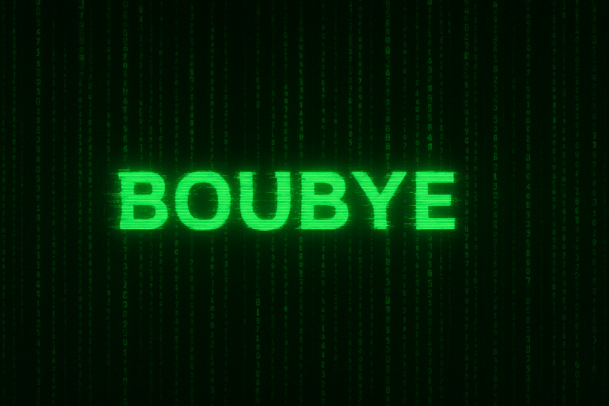
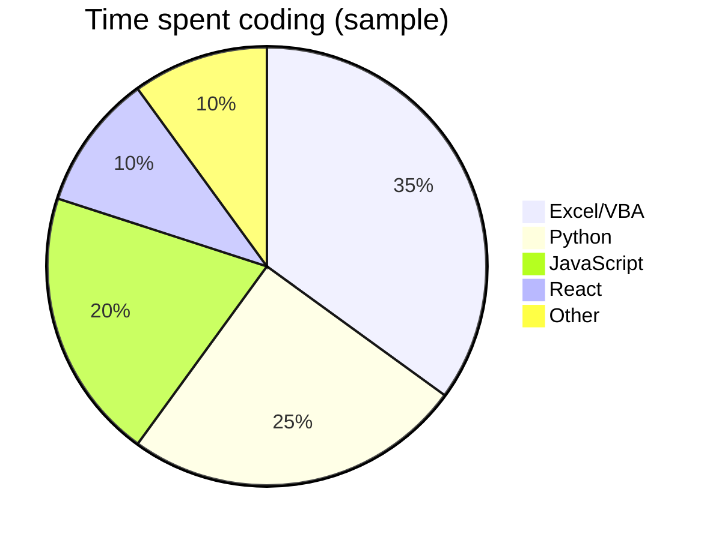

<p align="center">
  
</p>

<p align="center">
  <a href="https://linkedin.com/in/YourLinkedIn"></a>
  <a href="https://medium.com/@YourMedium"></a>
</p>

---

## 🌍 About Me

```yaml
name: Mohamed Gamal
location: Egypt
role: Banking Professional | Entrepreneur | Writer
focus_on: ["Excel & Data Auditing", "Process Improvement", "Fashion Brand (Camie)", "Creative Writing"]
passions: ["Technology", "Storytelling", "Entrepreneurship", "Gemstones & Natural Materials"]
fun_fact: "I’m building a clothing brand while working full-time in the banking sector."

Agriculture:
  - Mango tree management (20+ yrs old orchards)
  - Disease control, pruning, grafting, rejuvenation
  - Soil & plant diagnostics

Electronics:
  - Microcontrollers: MC68HC908JB8, MC3361 (RF chips)
  - Wireless receiver hacking (2.4 GHz, DIY experiments)
  - Curiosity-driven hardware tear-downs

Earth & Science:
  - Geology: hematite, fossils, placer gold, sandstones
  - Volcanic + marine rock exploration
  - Field-based mineral ID

Ideas:
  - Qur’anic linguistic studies
  - Philosophical reflections
  - Cross-domain problem solving
```
<p align="center">
  
</p>

---
```yaml
## ⚔️ Who am I?

- 💻 Elite hacker nerd wandering in the code jungles  
- 🛡️ Warrior soul forged by scars and resilience  
- 📡 Geek of systems, signals, and the unseen  
- 🌍 From Egypt, standing with Palestine ✊  

---

<p align="center">
  
</p>

---
```

## 📜 Purpose of Life  

<p align="center">
  
</p>

> **“I created jinn and humans so they may live rightly and submit to Allah.”**  
> — Surah Adh-Dhariyat 51:56

---
## 🕶️ Tech Stack

<p align="center">
  
</p>

---

## 🎮 Nerd Zone  

- 🎲 Retro gaming & hacking consoles  
- 🛰️ Reverse engineering signals + wireless devices  
- 📡 Always tinkering with microcontrollers & antennas  
- 🧩 Obsession: puzzles, cryptography, and breaking patterns  

---

## 🌈 H4ck3r Status Bar


```text
[███████████████---------] 1337% — System Breach Complete
```

## 🔥 Quote of the Code

**“Scars are not wounds — they are medals of the soul.”**

---

## 🎭 Fun Fact

I don’t just **write code**… I **make it bleed neon**.


<p align="center">
  
</p>

---
```text
LEARN EVERY DAY A NEW PIECE OF INFORMATION
```

---

## 🛠️ Skills & Tools

<p align="left">
  
  
  
  
  
  
  
</p>

---

## 📊 GitHub Stats & Charts

<p align="center">
  
  
</p>

<p align="center">
  
</p>

---

## 📈 Time & Activity Breakdown

### Programming Language Usage (Example)



---

## 📊 Career / Project Focus Table

| Area                     | % Focus | Tools Used                           |
| ------------------------ | ------- | ------------------------------------ |
| Banking & Excel Auditing | 40%     | Excel, VBA, Automation               |
| Fashion Brand (Camie)    | 25%     | Shopify, Marketing, Social Media     |
| Creative Writing         | 20%     | Markdown, Google Docs, Editing Tools |
| Tech Learning & Coding   | 15%     | Python, JavaScript, React, GitHub    |

---

## ✍️ Writing & Projects

* 📖 Passionate about **literature** & editing Arabic texts.
* 🧵 Founder of **Camie**, an online **fashion brand**.
* 📊 Improving **Excel auditing workflows** in the banking sector.
* 💎 Curious explorer of **gemstones and natural crystals**.

---

## 🎯 Fun Section

> "Building bridges between finance, fashion, and creativity — one step at a time."


## 💍 Wedding Ideas (Visualized)
<details> <summary>🍰 Food & Cake Ideas</summary>
%%{init: {"theme":"base", "themeVariables": {
  "barColor":"#8B4513",  /* Brown for Mediterranean Dishes */
  "barColor2":"#FFB6C1", /* Pink for Desserts */
  "barColor3":"#FFFFFF", /* White for Wedding Cake */
  "barTextColor":"#000000"
}}}%%
bar title 🍰 Food & Cake
    "🍽️ Mediterranean Fusion" : 35
    "🧁 Dessert Corner" : 25
    "🎂 Wedding Cake (3+ tiers)" : 40

</details> ```
<details>
  <summary>🎨 Wedding Theme Preferences</summary>

```mermaid
%%{init: {"theme":"base", "themeVariables": {
  "bar1":"#FFD700",  /* Gold */
  "bar2":"#228B22",  /* Green */
  "bar3":"#000000",  /* Black */
  "bar4":"#1E90FF"   /* Blue */
}}}%%
bar title 🎨 Wedding Themes
    "👑 Classic White & Gold" : 40
    "🌿 Rustic Boho Chic" : 25
    "⚪ Minimalist Black & White" : 20
    "🕌 Egyptian Inspired" : 15
```

</details>

<details>
  <summary>🌸 Decoration Breakdown</summary>

```mermaid
%%{init: {"theme":"base", "themeVariables": {
  "bar1":"#FF0000",  /* Red (Roses) */
  "bar2":"#FFA500",  /* Orange (Candles) */
  "bar3":"#9370DB",  /* Purple (Fairy Lights) */
  "bar4":"#008080"   /* Teal (Cards) */
}}}%%
bar title 🌸 Decoration Ideas
    "🌹 Flower Arches" : 30
    "🕯️ Floating Candles" : 25
    "✨ Fairy Lights" : 25
    "✍️ Personalized Cards" : 20
```

</details>

<details>
  <summary>🎶 Entertainment Options</summary>

```mermaid
%%{init: {"theme":"base", "themeVariables": {
  "bar1":"#8B0000",  /* Dark Red (Band) */
  "bar2":"#0000CD",  /* Blue (DJ) */
  "bar3":"#FF69B4",  /* Pink (Dance) */
  "bar4":"#FF4500"   /* Orange/Red (Fire) */
}}}%%
bar title 🎶 Entertainment Choices
    "🥁 Live Oriental Band" : 35
    "🎧 DJ Set" : 30
    "💃 Dance Group" : 20
    "🔥 Fire Show" : 15
```
</details>

<details>
  <summary>🍰 Food & Cake Ideas</summary>

```mermaid
%%{init: {"theme":"base", "themeVariables": {
  "bar1":"#32CD32",  /* Green (Mediterranean Food) */
  "bar2":"#FFB6C1",  /* Pink (Dessert Corner) */
  "bar3":"#DAA520"   /* Golden (Cake) */
}}}%%
bar title 🍰 Food & Cake
    "🍽️ Mediterranean Fusion" : 35
    "🧁 Dessert Corner" : 25
    "🎂 Wedding Cake (3+ tiers)" : 40
```

</details>

---

## 🕒 Wedding Day Timeline

```mermaid
gantt
    dateFormat  HH:mm
    axisFormat  %H:%M
    title ⏰ Wedding Day Schedule

    section Ceremony
    Guests Arrive        :done,    des1, 16:00, 30m
    Wedding Ceremony     :active,  des2, 16:30, 60m

    section Reception
    Cocktail Hour        :         des3, 17:30, 30m
    Dinner & Speeches    :         des4, 18:00, 90m

    section Celebration
    Cake Cutting         :         des5, 19:30, 30m
    First Dance          :         des6, 20:00, 30m
    Dance Party & DJ     :         des7, 20:30, 150m
    Fire Show Finale     :         des8, 23:00, 30m
```



